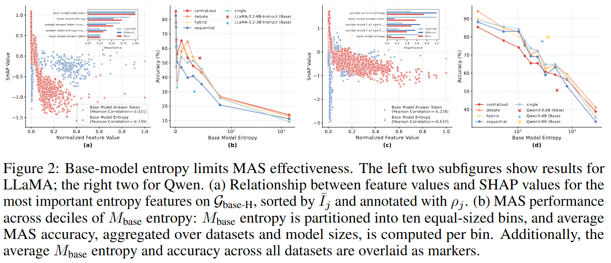
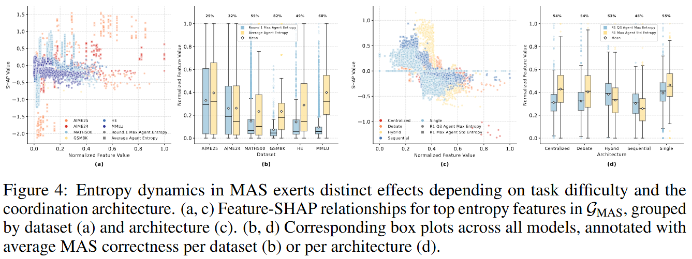

<div align="center">
<h1>When Does Multi-Agent Collaboration Help? An Entropy Perspective</h1>

Yuxuan Zhao<sup>1,2</sup>,  Sijia Chen<sup>2</sup>†,  Ningxin Su<sup>2</sup>

<sup>1</sup> Yantai Research Institute of Harbin Engineering University <sup>2</sup> Hong Kong University of Science and Technology (Guangzhou)

<sup>†</sup> Corresponding Author  

<a href="https://arxiv.org/abs/2602.04234">  </a>

</div>

### Overview

Multi-agent systems (MAS) have emerged as a prominent paradigm for leveraging large language models (LLMs) to tackle complex tasks. However, the mechanisms governing the effectiveness of MAS built upon publicly available LLMs, specifically the underlying rationales for their success or failure, remain largely unexplored. In this paper, we revisit MAS through the perspective of \textit{entropy}, considering both intra- and inter-agent dynamics by investigating entropy transitions during problem-solving across various topologies, six reasoning benchmarks, and two agentic tasks. By analyzing 245 features spanning token-, agent-, and round-level entropy, we counterintuitively find that a single agent outperforms MAS in approximately 43.3\% of cases, and that entropy dynamics are largely determined during the first round of interaction. Furthermore, we provide three key observations: 1) \textit{Certainty Preference}: peak entropy directly harms and stable entropy directly benefits MAS correctness; 2) \textit{Base Entropy}: base models with lower entropy during problem-solving causally drive MAS performance; and 3) \textit{Task Awareness}: entropy dynamics of MAS play varying roles across different tasks. Building on these insights, we introduce a simple yet effective algorithm, the \textit{Entropy Judger}, to select solutions from MAS's pass@$k$ results, leading to consistent accuracy improvements across all MAS configurations and tasks.

---

### Main Results

<div align="center">

</div>

<div align="center">

</div>

<div align="center">

</div>

<div align="center">

</div>

---

### Installation

```bash
# 1. Clone this repo and install the package
git clone https://github.com/AgenticFinLab/multiagent-entropy.git
cd multiagent-entropy
pip install -e .

# 2. Clone and install lmbase (dataset loading and LLM inference dependency)
git clone https://github.com/AgenticFinLab/lmbase.git
cd lmbase && pip install -e . && cd ..
```

---

### Prerequisites

#### Environment Variables

Copy `.env.example` to `.env` and fill in the keys you need:

```bash
cp .env.example .env
```

| Variable            | Required for                            | Description                                                                                                |
| ------------------- | --------------------------------------- | ---------------------------------------------------------------------------------------------------------- |
| `HF_TOKEN`          | All experiments (gated models/datasets) | HuggingFace access token — [get it here](https://huggingface.co/settings/tokens)                           |
| `SERPAPI_API_KEY`   | FinAgent, GAIA                          | Web search (primary) — [serpapi.com](https://serpapi.com)                                                  |
| `SERPER_API_KEY`    | FinAgent, GAIA                          | Web search (fallback) — [serper.dev](https://serper.dev)                                                   |
| `SEC_EDGAR_API_KEY` | FinAgent only                           | SEC EDGAR filings search — [sec-api.io](https://sec-api.io); optional, falls back to mock results if unset |
| `ARK_API_KEY`       | GAIA only                               | ByteDance ARK / Doubao multimodal API for image/audio/video attachments; text-only tasks work without it   |

The six standard benchmarks (GSM8K, HumanEval, MMLU, MATH500, AIME2024, AIME2025) require **no API keys** beyond an optional `HF_TOKEN` for gated repos.

#### Datasets

Datasets are **downloaded automatically from HuggingFace** on first run using paths configured in `experiments/configs/dataset_specific/*.yml`. No manual download is needed for the standard benchmarks.

For **GAIA**, additionally download task attachments after the dataset is fetched:

```bash
python experiments/scripts/tools/download_gaia_attachments.py
```

#### Models

Model weights are **pulled automatically from HuggingFace** using the `lm_name` field in each model config (e.g. `Qwen/Qwen3-4B`). To use a locally downloaded model, replace `lm_name` with the local directory path:

```yaml
# experiments/configs/model_specific/qwen3-4b.yml
lm_name: /path/to/local/Qwen3-4B
```

---

### Project Structure

```
multiagent-entropy/
├── README.md                          ## Project overview and documentation
├── requirements.txt                   ## Python dependencies
├── setup.py                           ## Package setup configuration
├── maep/                              ## Core package: Multi-Agent Entropy Package
│   ├── entropy_infer.py               ## Entropy inference utilities
│   ├── generic.py                     ## Generic agent implementation
│   └── language/                      ## Seven MAS architectures
│       ├── single.py                  ## Single agent baseline
│       ├── sequential.py              ## Sequential pipeline
│       ├── centralized.py             ## Centralized orchestration
│       ├── decentralized.py           ## Decentralized with loopback
│       ├── full_decentralized.py      ## Full communication graph
│       ├── debate.py                  ## Majority voting
│       ├── hybrid.py                  ## Enhanced context sharing
│       ├── react_utils.py             ## ReAct parsing helpers and constants
│       └── react_loop.py              ## ReActExecutor — tool-augmented reasoning loop
├── experiments/                       ## Experiment execution
│   ├── configs/                       ## Configuration files
│   │   ├── base_config.yml            ## Base configuration
│   │   ├── agent_specific/            ## Agent architecture configs
│   │   ├── dataset_specific/          ## Dataset configs (GSM8K, AIME, FinAgent, GAIA, etc.)
│   │   └── model_specific/            ## Model configs (Qwen3, LLaMA, etc.)
│   ├── scripts/
│   │   ├── run_experiment.py          ## Standard experiment runner
│   │   ├── run_finagent_experiment.py ## FinAgent finance benchmark runner
│   │   ├── run_gaia_experiment.py     ## GAIA benchmark runner
│   │   ├── config_loader.py           ## Configuration loader
│   │   ├── tools/
│   │   │   ├── download_gaia_attachments.py ## GAIA task attachment downloader
│   │   │   └── regenerate_gaia_evaluation.py ## Re-evaluate existing GAIA results
│   │   ├── finagent_experiment/       ## FinAgent tools, evaluation, prompts
│   │   └── gaia_experiment/           ## GAIA tools, evaluation, prompts
│   ├── results/
│   │   ├── raw/                       ## Raw experiment results
│   │   └── aggregated/                ## Aggregated results
│   └── data/                          ## Dataset storage
├── evaluation/                        ## Result evaluation and feature extraction
│   ├── base/                          ## Shared base-class subpackage
│   │   ├── constants.py               ## DATASETS, DATASET_TASK_MAP, infer_task_type
│   │   ├── architecture.py            ## Agent-type / round-number helpers
│   │   ├── data_loader.py             ## BaseDataLoader
│   │   ├── analyzer.py                ## BaseAnalyzer
│   │   └── evaluator.py               ## BaseEvaluator (shared CSV/summary pipeline)
│   ├── evaluator.py                   ## StandardEvaluator — main evaluation entry
│   ├── temperature_ablation_evaluator.py ## TempAblationEvaluator (temp 0.4/0.6/0.8)
│   ├── temperature_ablation_data_loader.py ## TempDataLoader
│   ├── aggregator.py                  ## Data aggregation (JSON → CSV)
│   ├── feature_enhancer.py            ## 245-feature extraction
│   ├── entropy_statistic.py           ## Entropy statistics
│   ├── experiment_analyzer.py         ## Per-experiment metrics
│   ├── metrics_summary.py             ## Summary CSV generation
│   └── results/                       ## Evaluation outputs
├── data_mining/                       ## Data mining analysis
│   ├── code/
│   │   ├── base/                      ## Shared base-class subpackage
│   │   │   ├── analyzer.py            ## BaseAnalyzer template class
│   │   │   ├── constants.py           ## Centralized constants (models, params, plot defaults)
│   │   │   ├── feature_manager.py     ## FeatureManager (FinAgent / standard feature logic)
│   │   │   ├── model_factory.py       ## ModelFactory (RF / XGBoost / LightGBM)
│   │   │   ├── io_utils.py            ## OutputManager, save_plot, load_dataset_csv
│   │   │   ├── cli.py                 ## Shared argparse builders
│   │   │   └── post_processor.py      ## BasePostProcessor (experiment iteration)
│   │   ├── causal_analysis/           ## Causal inference subpackage
│   │   │   ├── causal_discovery.py    ## PC/FCI causal graph learning
│   │   │   ├── causal_effect_estimator.py ## ATE/CATE estimation with DoWhy
│   │   │   ├── causal_mediation_analyzer.py ## Mediation analysis (direct vs indirect effects)
│   │   │   ├── causal_report_generator.py ## Unified causal analysis report
│   │   │   ├── feature_selection_crossval.py ## Cross-validated feature selection
│   │   │   └── run_causal_on_correlation_results.py ## 4-stage pipeline orchestrator
│   │   ├── main.py                    ## Main CLI entry for data mining
│   │   ├── data_mining_analyzer.py    ## Unified orchestrator
│   │   ├── regression_analyzer.py     ## Experiment-level regression (BaseAnalyzer)
│   │   ├── classification_analyzer.py ## Sample-level classification (BaseAnalyzer)
│   │   ├── shap_analyzer.py           ## SHAP interpretability (BaseAnalyzer)
│   │   ├── pca_analyzer.py            ## PCA feature redundancy (BaseAnalyzer)
│   │   ├── feature_ablation_analyzer.py ## Feature ablation study (BaseAnalyzer)
│   │   ├── calibration_analyzer.py    ## Calibration analysis
│   │   ├── mas_causal_analysis.py     ## SAS vs MAS separation-control causal analysis
│   │   ├── aggregator.py              ## Experiment result aggregation
│   │   ├── visualizer.py              ## Aggregated result visualization
│   │   ├── summarizer.py              ## Statistical summarization
│   │   ├── data_collector.py          ## Data collection and merging
│   │   ├── features.py                ## Feature group definitions
│   │   ├── utils.py                   ## Shared utility functions
│   │   └── run_experiments.py         ## Automated batch experiment runner
│   └── results/                       ## Analysis results
├── entropy_judger/                    ## Entropy Judger: pass@K solution selection
│   ├── train_judger.py                ## Train and serialize the judger from existing data
│   ├── run_single.py                  ## Single-run wrapper (overrides save_folder)
│   ├── run.sh                         ## Run K=20 repeated inferences
│   └── evaluate.py                    ## Score runs and produce comparison tables
└── docs/                              ## Documentation
    ├── experiment-guidance.md         ## Experiment guide
    ├── evaluation-guidance.md         ## Evaluation guide
    ├── data-mining-guidance.md        ## Data mining guide
    └── entropy-judger-guidance.md     ## Entropy Judger guide
```

---

### Quick Start

#### 1. Running Experiments

Run a single experiment:

```bash
python experiments/scripts/run_experiment.py \
  --experiment-name qwen3-4b_gsm8k_single_agent \
  --base-config experiments/configs/base_config.yml \
  --model-config experiments/configs/model_specific/qwen3-4b.yml \
  --dataset-config experiments/configs/dataset_specific/gsm8k.yml \
  --agent-type single
```

Run batch experiments:

```bash
python experiments/scripts/run_experiment.py \
  --batch-config experiments/configs/batch_example_qwen3_4b_gsm8k.yml
```

#### 2. Evaluating Results

Evaluate experiments and extract entropy features:

```bash
python -m evaluation.evaluator --dataset gsm8k --run-aggregator
```

#### 3. Data Mining Analysis

Analyze factors affecting sample-level correctness:

```bash
cd data_mining/code
python main.py --analysis-type all
```

#### 4. Entropy Judger

Train the judger on existing data, run repeated inferences, and evaluate pass@K selection:

```bash
# Train and freeze the judger
python entropy_judger/train_judger.py

# Run K=20 repeated inferences (scope controlled via env vars)
bash entropy_judger/run.sh

# Evaluate: Best-of-K and Early-Stop comparison tables
python entropy_judger/evaluate.py
```

---

### Extensibility and Supported Configurations

#### 1. Supported MAS Architectures

- **Single**: Baseline with a single solver agent
- **Sequential**: Pipeline: planner → solver → critic → judger
- **Centralized**: Two-layer: domain agents + central orchestrator
- **Decentralized**: Sequential agents with loopback mechanism
- **Full Decentralized**: Fully connected communication among all agents
- **Debate**: Multi-agent debate with majority voting
- **Hybrid**: Two-layer with enhanced context sharing

#### 2. Supported Models and Datasets

- **Models**: Qwen3-0.6B, Qwen3-1.7B, Qwen3-4B, Qwen3-8B, LLaMA-3.1-8B-Instruct, LLaMA-3.2-3B-Instruct, Qwen2.5-7B-SimpleRL-Zoo
- **Datasets**: GSM8K, AIME2024, AIME2025, MMLU, HumanEval, MATH-500, FinAgent, GAIA

#### 3. Adding New Components

**New MAS Architectures**  
To implement a custom architecture:  

1. Create a Python file in `maep/language/` (e.g., `my_architecture.py`).  
2. Define an architecture class following patterns in `centralized.py` or `hybrid.py`.  
3. Add agent configurations in `experiments/configs/agent_specific/my_architecture_agents.yml`.  
4. Register the new type in `experiments/scripts/run_experiment.py`.  

**Custom Models**  
To integrate a new model:  

1. Create a YAML config in `experiments/configs/model_specific/` (e.g., `my_model.yml`):  
   
   ```yaml
   lm_name: "path/to/your/model"
   inference_config:
     device: "cuda"
     torch_dtype: "float16"
   ```
2. Specify it at runtime:  
   
   ```bash
   python experiments/scripts/run_experiment.py \
     --model-config experiments/configs/model_specific/my_model.yml
   ```

**Custom Datasets**  
To add a new dataset:  

1. Create a YAML config in `experiments/configs/dataset_specific/` (e.g., `my_dataset.yml`):  
   
   ```yaml
   data:
     data_name: "MyDataset"
     data_path: "experiments/data/MyDataset"
     split: "test"
     data_num: -1  # -1 for all samples
     batch_size: 1
   task_type: "math"  # math, code, or option
   generation_config:
     max_new_tokens: 2048
   ```
2. Place data in `experiments/data/MyDataset/` using the expected format.  
3. Run with:  
   
   ```bash
   python experiments/scripts/run_experiment.py \
     --dataset-config experiments/configs/dataset_specific/my_dataset.yml
   ```

---

### Documentation

- [Experiment Guidance](docs/experiment-guidance.md): Experiment configuration and execution
- [Evaluation Guidance](docs/evaluation-guidance.md): Evaluation framework and feature extraction
- [Data Mining Guidance](docs/data-mining-guidance.md): Data mining and SHAP analysis
- [Entropy Judger Guidance](docs/entropy-judger-guidance.md): pass@K solution selection experiment

---

### Citation

If you find this work useful, please cite:

```bibtex
@article{multiagent-entropy,
  title={When Does Multi-Agent Collaboration Help? An Entropy Perspective},
  author={Yuxuan Zhao, Sijia Chen, Ningxin Su},
  journal={arXiv preprint arXiv:2602.04234},
  year={2026},
}
```
